# RFM Customer Segmentation — Online Retail Store
### End-to-End Data Analytics Project | Excel · Python · Power BI · MySQL

> Segmented 4,338 customers of a UK-based online retailer using RFM analysis, uncovering that Loyal and At Risk customers together make up 53.7% of the base — and that a targeted win-back campaign for At Risk customers likely offers the highest ROI of any single retention action.

---

## Business Problem

An online retail store has transaction data for its customers but no visibility into customer behavior or value. Some customers visit frequently but spend very little. High-value customers who generate significant revenue are at risk of churning and not returning. Some customers take long gaps before purchasing again. The business needs a structured way to understand and classify its customer base so retention and marketing budget can be spent where it matters most.

---

## Objective

Segment customers using **RFM Analysis**:

- **Recency (R):** How recently a customer made a purchase
- **Frequency (F):** How many times a customer made a purchase
- **Monetary (M):** How much total money a customer spent

By identifying these segments, the business can prioritize retention, re-engagement, and reward strategies for each customer type instead of treating all customers the same.

---

## Dataset

**Source:** [UCI Machine Learning Repository — Online Retail Dataset](https://archive.ics.uci.edu/dataset/352/online+retail)

A transactional dataset from a UK-based online retailer covering all purchases between December 2010 and December 2011.

| Stage | Rows | Columns | Notes |
|---|---|---|---|
| Raw Data | 541,909 | 8 | InvoiceNo, StockCode, Description, Quantity, InvoiceDate, UnitPrice, CustomerID, Country |
| After removing null CustomerID | 406,829 | 8 | 135,080 rows dropped — guest/unregistered transactions can't be tied to a customer |
| After removing duplicates | 401,604 | 8 | 5,225 duplicate rows dropped |
| After removing cancelled orders | 392,732 | 8 | Rows where InvoiceNo starts with 'C' dropped |
| After removing negative/zero UnitPrice | **392,692** | **9** | Final clean dataset (TotalPrice column added) |

**Final customer base after RFM aggregation: 4,338 unique customers**

---

## Project Pipeline

Excel Overview → Python Data Cleaning → Python EDA → RFM Calculation & Segmentation → Power BI Dashboard → MySQL Business Queries

---

## Phase 0 — Data Overview (Excel)

Before writing any cleaning code, the raw data was opened in Excel to manually identify data quality issues:

- Filtered the `CustomerID` column and confirmed blank values existed
- Filtered `Quantity` and found large negative values tagged with descriptions like *"thrown away"*, *"damaged"*, *"check"* — these are stock write-offs, not real sales
- Filtered `UnitPrice` and found 2,477 rows with a price of 0

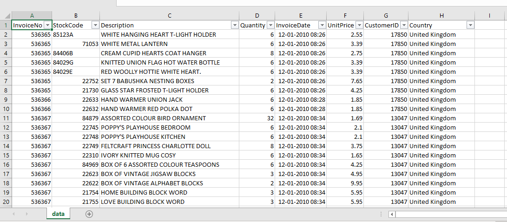
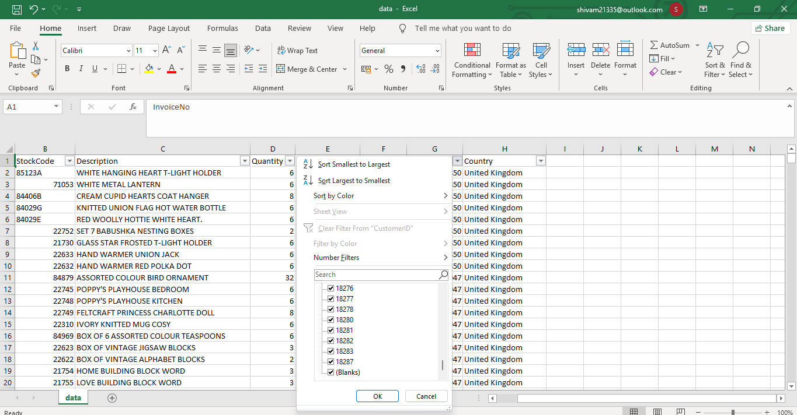
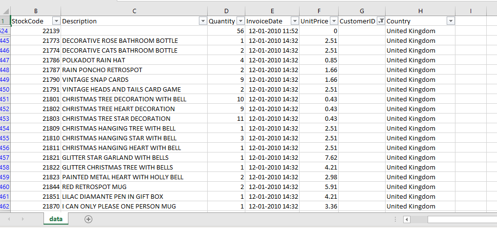
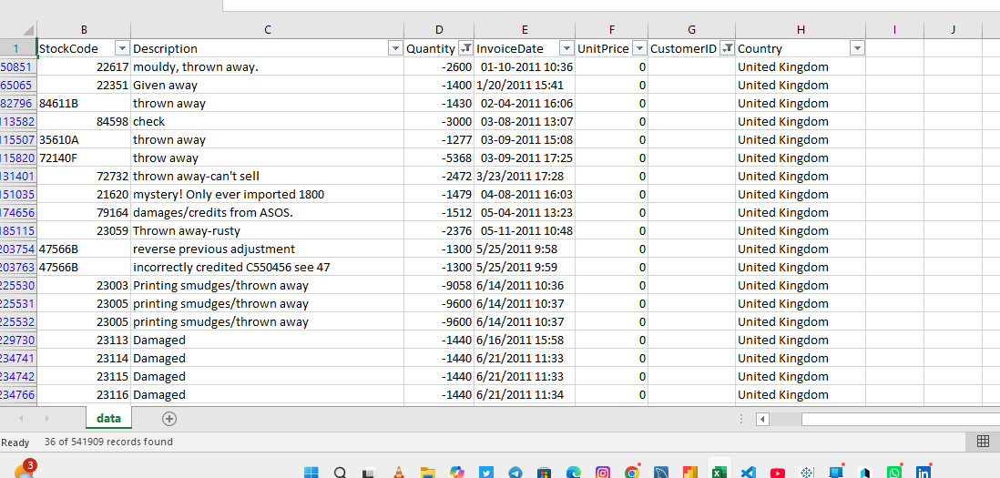
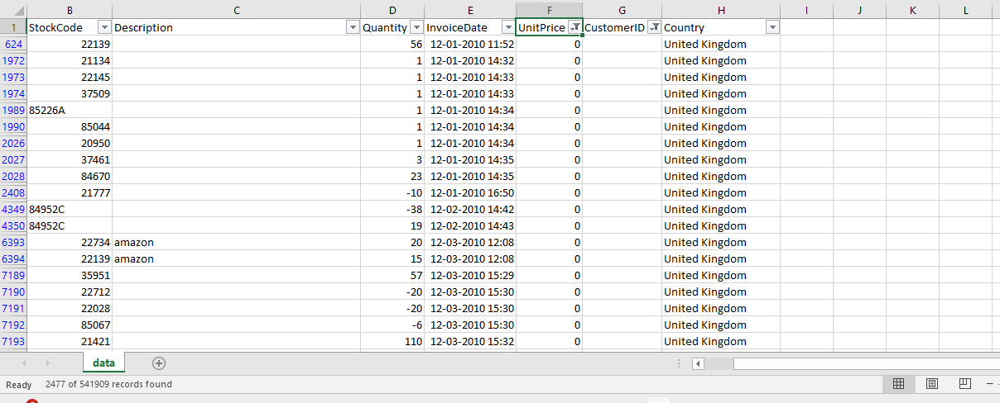

---

## Phase 1 — Data Cleaning + EDA (Python)

**Libraries:** Pandas, Matplotlib, Seaborn | **Environment:** Jupyter Notebook

### Cleaning Steps

| Step | Action | Result |
|---|---|---|
| 1.3 | Initial overview — `df.shape`, `df.info()` | 541,909 rows × 8 columns; 135,080 nulls in CustomerID, 1,454 in Description |
| 1.4 | Dropped null CustomerID rows | 406,829 rows remaining |
| 1.5 | Removed duplicate rows | 5,225 duplicates dropped → 401,604 rows |
| 1.6 | Removed cancelled orders (InvoiceNo starting with 'C') | 392,732 rows remaining |
| 1.7 | Removed negative/zero UnitPrice rows | 392,692 rows remaining |
| 1.8 | Converted InvoiceDate to datetime | dtype fixed for time-based calculations |
| 1.9 | Created `TotalPrice = Quantity × UnitPrice` | New column for revenue calculations |

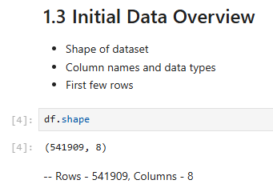
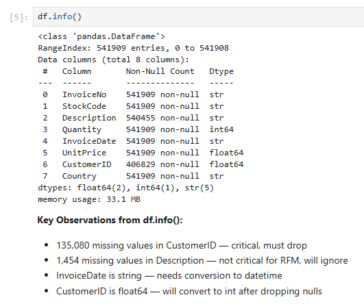
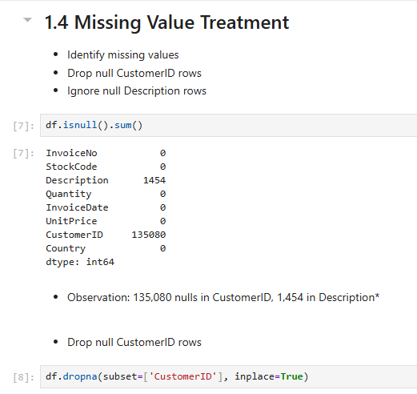
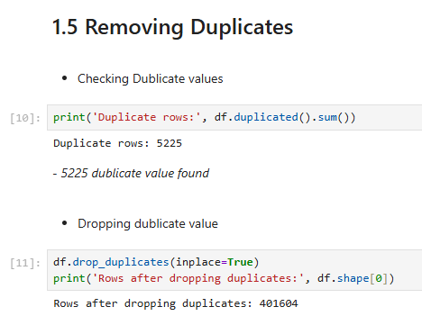
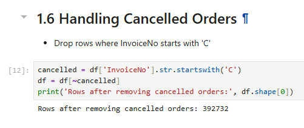
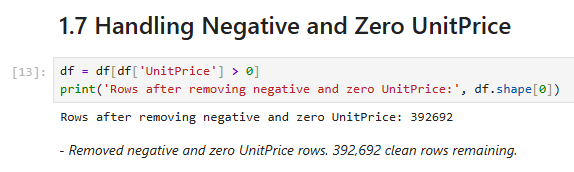
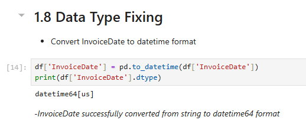
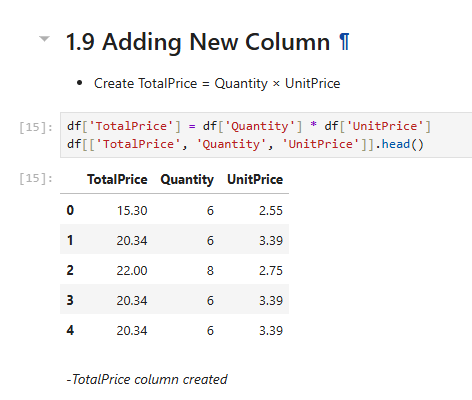
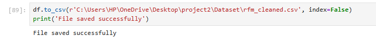

### Exploratory Data Analysis

| Chart | Key Observation |
|---|---|
| Sales by Country | United Kingdom dominates at ~7.3M — the business is overwhelmingly UK-based |
| Monthly Revenue Trend | Clear seasonal peak in Nov 2011, sharp drop in Dec 2011 (partial month in data) |
| Top 10 Customers by Revenue | Top customer (14646) generated ₹280K+ — revenue is concentrated in a small group |
| Order Frequency Distribution | Right-skewed — most customers placed only 1–5 orders; 20+ order customers are rare but likely high-value |

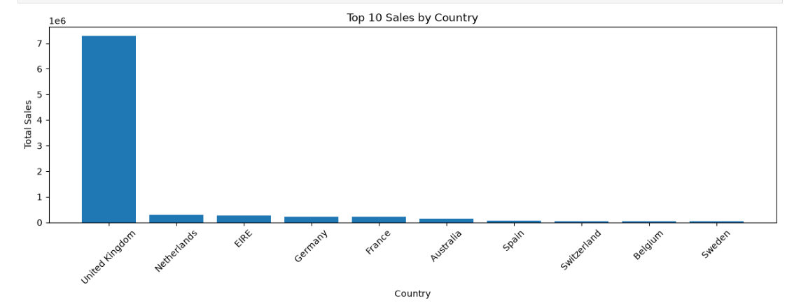
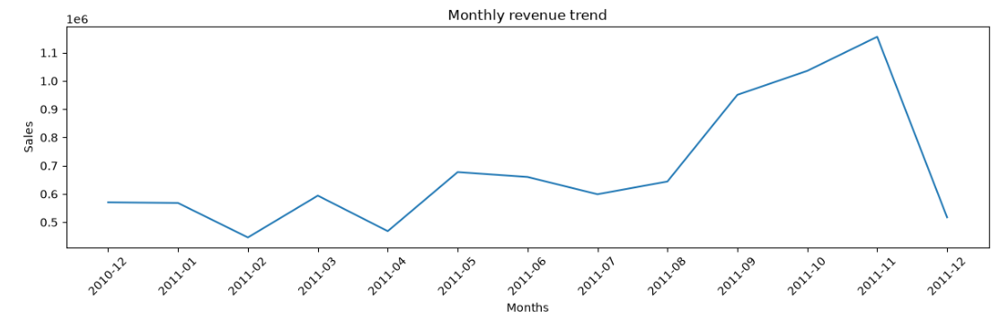
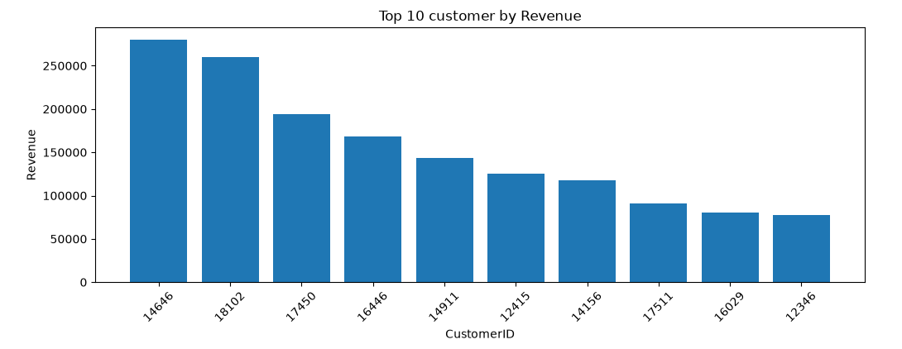
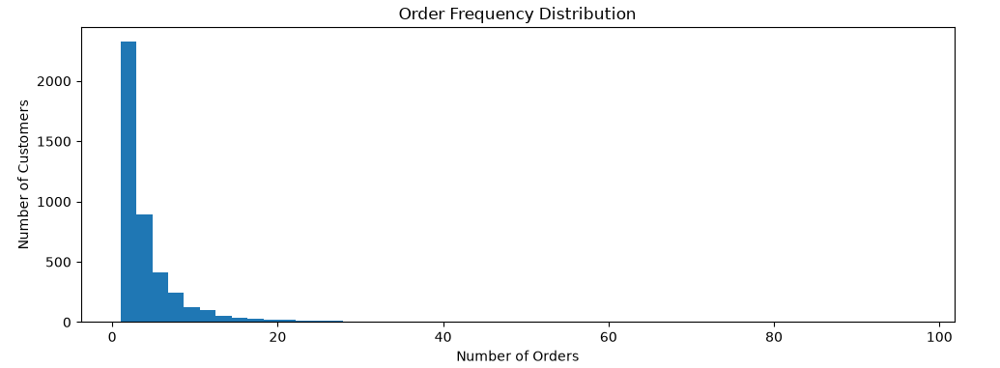

---

## Phase 2 — RFM Calculation & Customer Segmentation (Python)

### RFM Metric Calculation

| Metric | Method | Logic |
|---|---|---|
| Recency | `(reference_date - LastPurchaseDate).dt.days` | Lower = more recent = better |
| Frequency | `groupby('CustomerID')['InvoiceNo'].nunique()` | Higher = more engaged |
| Monetary | `groupby('CustomerID')['TotalPrice'].sum()` | Higher = more revenue generated |

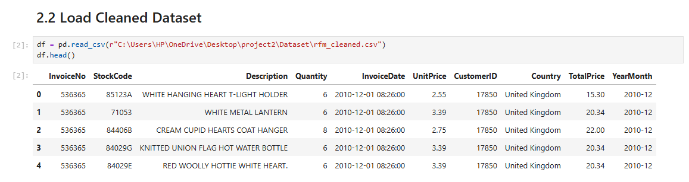
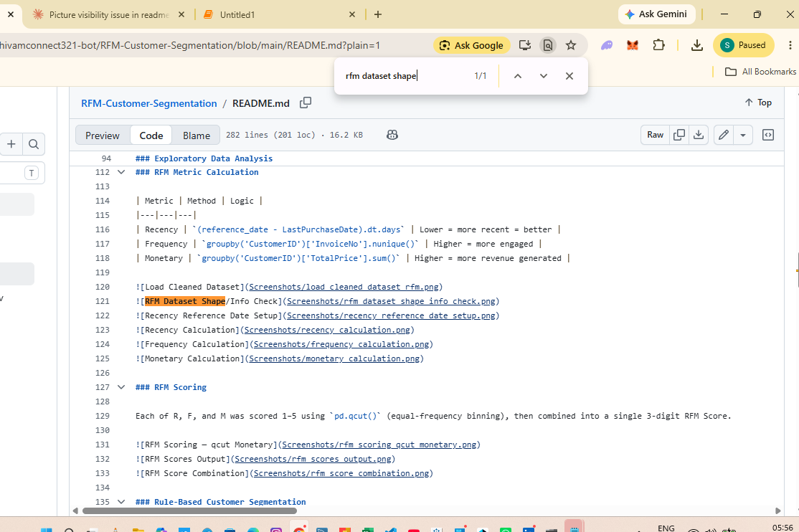
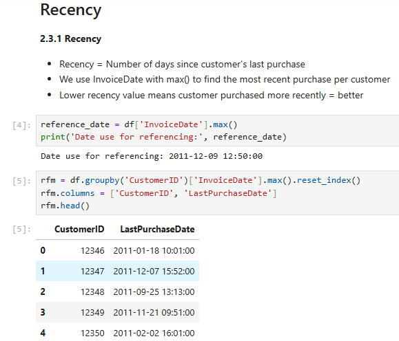
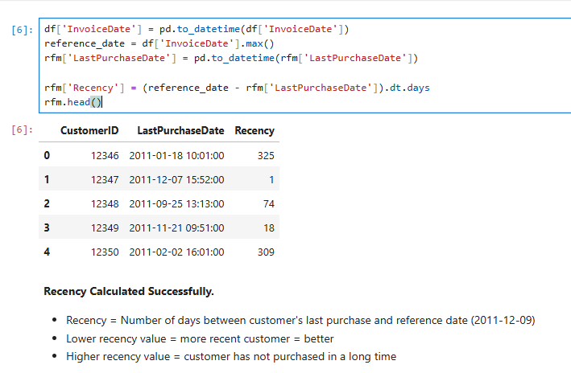
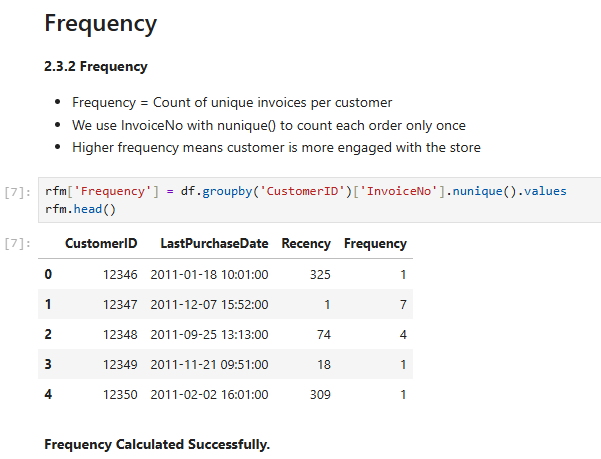
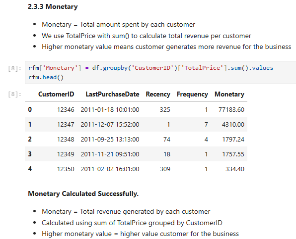

### RFM Scoring

Each of R, F, and M was scored 1–5 using `pd.qcut()` (equal-frequency binning), then combined into a single 3-digit RFM Score.

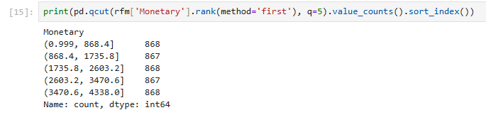
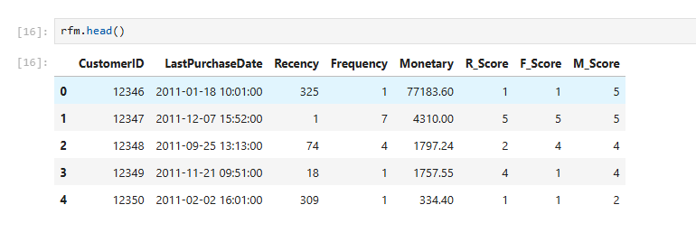
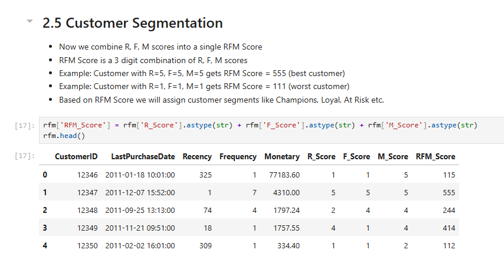

### Rule-Based Customer Segmentation

A priority-based rule engine maps RFM scores to business segments — highest-value segments are checked first, broader recency/frequency bands last, with no residual "Others" bucket.

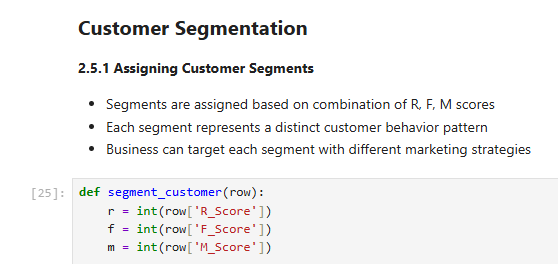
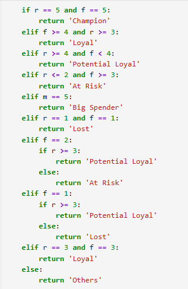
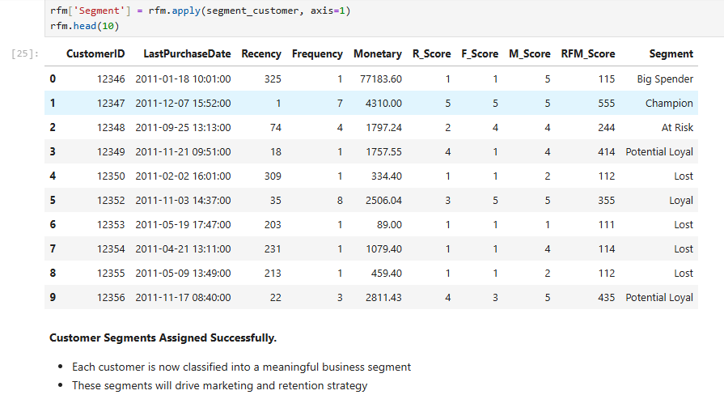
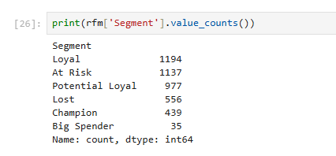

### Final Segment Distribution

| Segment | Count | % of Customers | Business Meaning |
|---|---|---|---|
| Loyal | 1,194 | 27.5% | Frequent, reliable buyers with decent spend |
| At Risk | 1,137 | 26.2% | Previously active, recency has dropped — needs win-back |
| Potential Loyal | 977 | 22.5% | Recent buyers with low frequency — needs nurturing |
| Lost | 556 | 12.8% | Long inactive, low frequency — low-priority reactivation |
| Champion | 439 | 10.1% | Recent, frequent, high spend — retain and reward |
| Big Spender | 35 | 0.8% | High monetary value outliers — VIP/white-glove treatment |

> **Key observation:** Loyal and At Risk together make up over half the customer base (~54%), consistent with the dataset's known pattern of a large repeat-buyer core alongside a significant declining-engagement group. Big Spender is intentionally a narrow, high-priority segment (M_Score = 5, not already captured by a higher-priority rule) representing high-value outliers who warrant individual retention attention despite low volume.

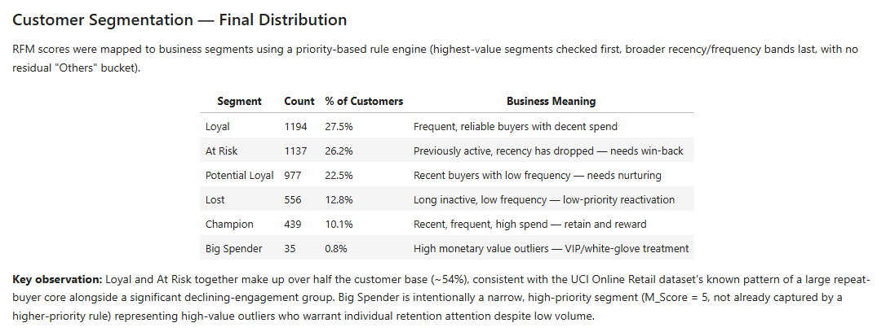
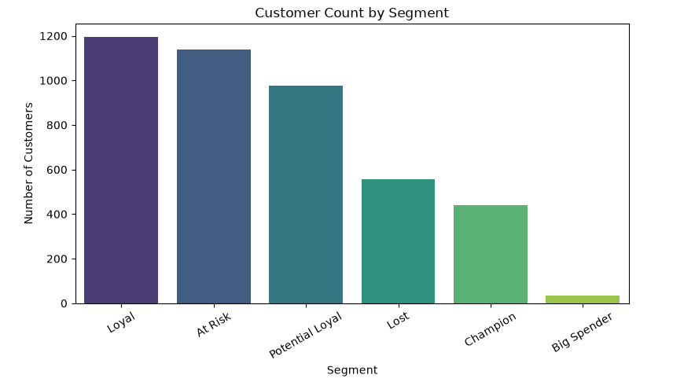
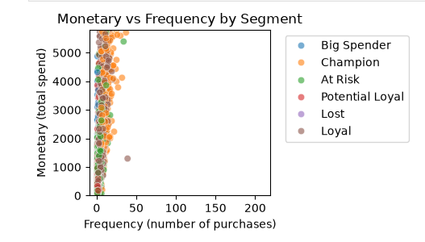
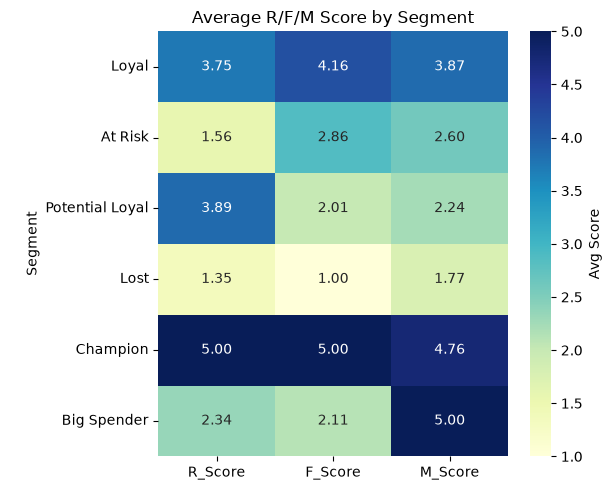
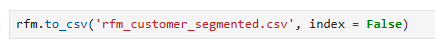

---

## Phase 3 — Power BI Dashboard

**Page 1 — Executive Overview**

- 4 KPI Cards: Total Customers (4.34K) · Total Revenue (₹8.89M) · Average Order Value (479.56) · Champion Revenue % (45.38%)
- Bar Chart: Total Revenue by Segment
- Donut Chart: Customer Count by Segment

**Page 2 — Segment Deep Dive**

- Segment slicer (shown filtered to At Risk)
- Bubble Chart: Recency vs Frequency (bubble size = Monetary)
- Table: Top 10 customers by value within the selected segment

**Dashboard Narrative:** Champion customers generate 45.38% of total revenue from just 10.1% of the customer base — the single highest revenue concentration of any segment. At Risk customers average only ₹870 in spend, but the top 10 within that segment exceed ₹6,900 each, with one customer alone accounting for ₹44,534. A blanket win-back campaign would waste budget on low-value At Risk accounts — the high-value ones need personalized outreach instead.

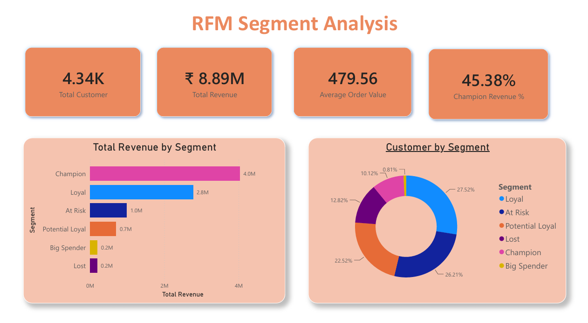
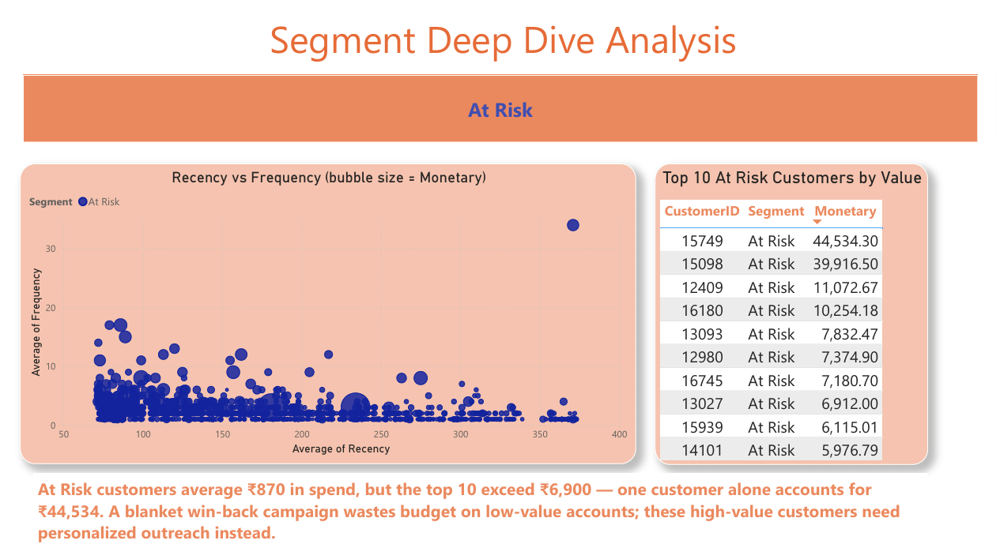

---

## Phase 4 — SQL Business Queries (MySQL 8.0)

**Database:** `rfm_analysis` | **Table:** `rfm_customer` | **Rows:** 4,338

| # | Business Question |
|---|---|
| 1 | How many customers fall into each segment, and what is their average Monetary value? |
| 2 | Who are the top 10 highest-value customers overall (by Monetary), and which segment do they belong to? |
| 3 | Who are the top 10 At Risk customers by Monetary value? |
| 4 | What is the average Recency, Frequency, and Monetary for each segment? |
| 5 | What percentage of total revenue does each segment contribute? |
| 6 | How many customers have a Frequency of only 1 (one-time buyers), and what segment are most of them in? |
| 7 | What is the average order value (Monetary ÷ Frequency) per segment? |
| 8 | Which segment has the highest average Recency (most inactive), and how many customers does it affect? |

### SQL Key Results

- **Champion** customers contribute **45.38%** of total revenue from only 439 customers
- **At Risk** is the largest actionable segment (1,137 customers, 26.2%) with an average Monetary value of ₹869.89
- **Big Spender** has the highest average order value at ₹2,930.42 — more than 5x higher than any other segment
- **Lost** segment has the highest average Recency (221 days) — 556 customers who haven't purchased in over 7 months
- 556 one-time buyers fall into the Lost segment, and 533 fall into Potential Loyal — most one-time buyers either churn immediately or are still early in their lifecycle

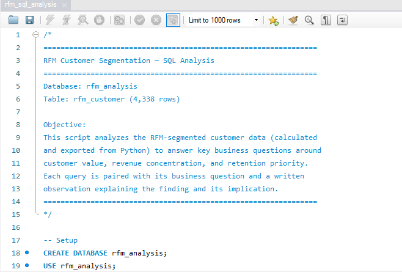
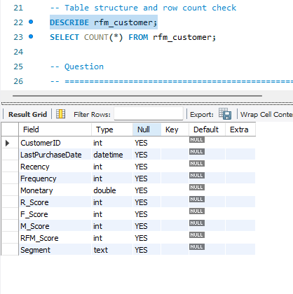
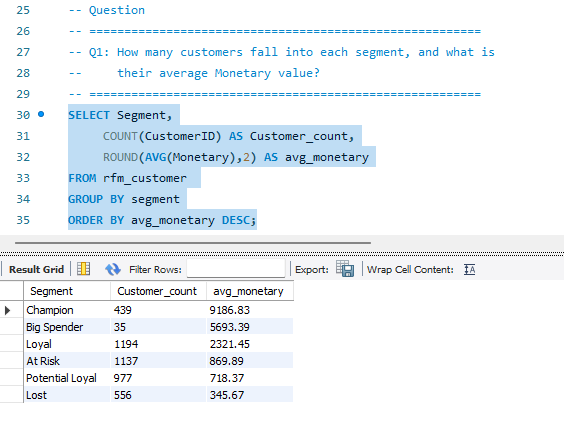
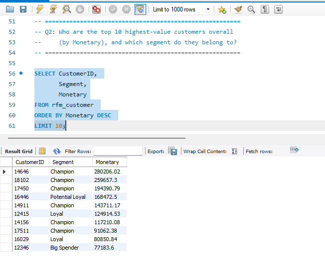
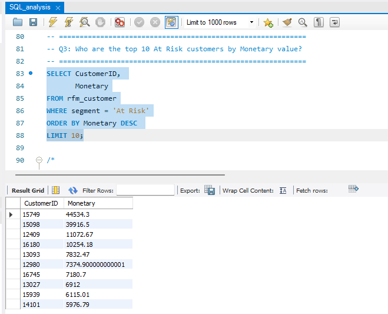
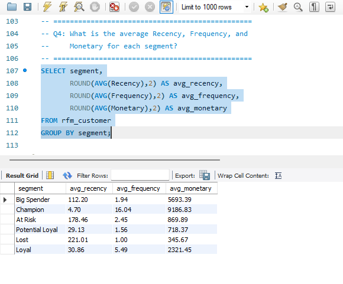
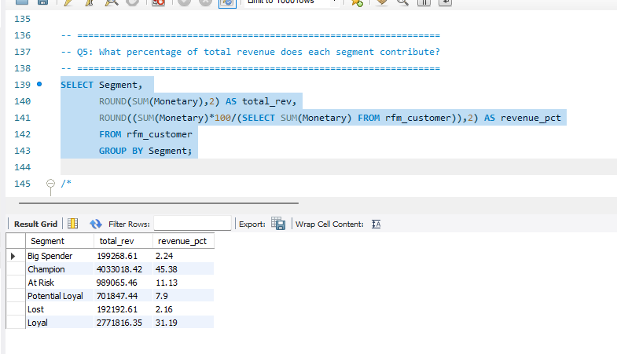
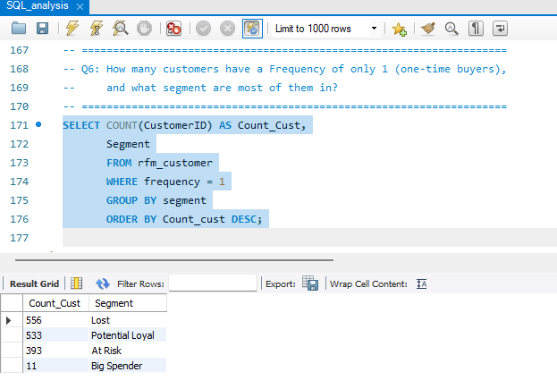
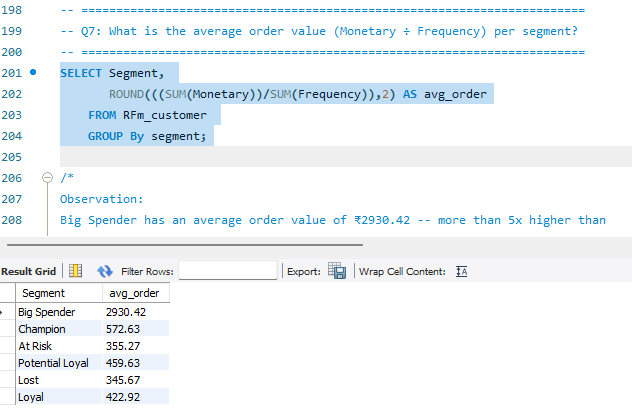
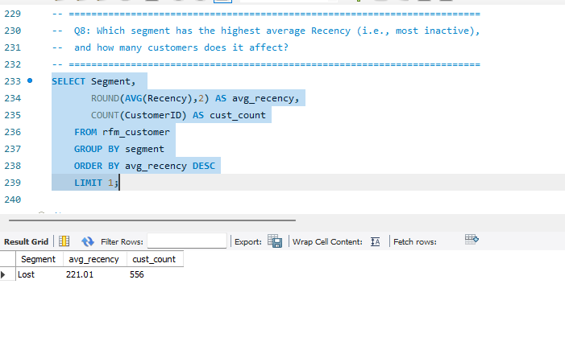

---

## Key Business Insights

| # | Insight | Business Impact |
|---|---|---|
| 1 | Loyal + At Risk = 53.7% of the customer base | The two largest segments demand distinct, opposite strategies — retention vs. win-back |
| 2 | Champion (10.1% of customers) drives 45.38% of revenue | Revenue is highly concentrated — losing even a few Champions has outsized impact |
| 3 | At Risk customers were previously valuable (higher F & M than Lost) | Win-back campaigns for At Risk likely offer the highest ROI of any single intervention |
| 4 | Big Spender is rare (0.8%) but has 5x the average order value of any other segment | Needs individual, white-glove retention — not automated campaigns |
| 5 | Majority of customers placed only 1–5 orders (right-skewed frequency) | High-frequency customers are rare and disproportionately valuable — worth identifying early |

---

## Business Recommendations

| # | Segment | Recommendation | Data Evidence |
|---|---|---|---|
| 1 | Champion (439, 10.1%) | Reward with loyalty perks, early access, and referral incentives to maximize retention and advocacy | Near-perfect R/F/M scores; generates 45.38% of total revenue |
| 2 | Big Spender (35, 0.8%) | Assign to a VIP/white-glove retention program with personalized outreach | High Monetary (5.0) despite lower Recency/Frequency; small in volume but high revenue risk if lost |
| 3 | Loyal (1,194, 27.5%) | Maintain engagement through regular communication and moderate incentives to prevent drift toward "At Risk" | Consistently solid across all three RFM dimensions |
| 4 | Potential Loyal (977, 22.5%) | Nurture with onboarding campaigns, second-purchase discounts, and product recommendations | Recent but low-frequency buyers — early lifecycle stage |
| 5 | At Risk (1,137, 26.2%) | Prioritize win-back campaigns — targeted discounts and re-engagement emails | Largest actionable segment; previously active with meaningfully higher F/M than Lost |
| 6 | Lost (556, 12.8%) | Low-cost automated reactivation only, or exclude from active marketing spend | Long inactive, lowest scores across all three RFM dimensions |

> **Bottom line:** Loyal and At Risk together represent over half the customer base. Since At Risk customers show meaningfully higher Frequency and Monetary scores than Lost customers, win-back campaigns targeting this segment likely offer the highest ROI of any single intervention — converting even a fraction of At Risk back to Loyal would have outsized revenue impact given the segment's size.

---

## Tools & Technologies

| Tool | Purpose |
|---|---|
| Microsoft Excel | Initial data overview, manual data quality checks |
| Python — Pandas, Matplotlib, Seaborn | Data cleaning, EDA, RFM calculation, rule-based segmentation |
| Jupyter Notebook | Python environment |
| Power BI Desktop | Two-page interactive dashboard, DAX measures |
| MySQL 8.0 + MySQL Workbench | SQL analysis — 8 business queries |

---

## Project Files

| File | Description |
|---|---|
| `data.csv` | Raw dataset (UCI Online Retail) |
| `rfm_cleaned.csv` | Cleaned dataset after Phase 1 |
| `rfm_customer_segmented.csv` | Final RFM-scored and segmented dataset |
| `01_data_cleaning_eda.ipynb` | Phase 1 — Data cleaning and EDA notebook |
| `02_rfm_segmentation.ipynb` | Phase 2 — RFM calculation and segmentation notebook |
| `rfm_dashboard.pbix` | Power BI dashboard file |
| `rfm_sql_analysis.sql` | MySQL queries (8 business questions) |

---

## Author

**Shivam Gupta**
B.Com (Hons) | Shaheed Bhagat Singh College, University of Delhi (2024)
NISM Research Analyst Certified

📧 shivamconnect321@gmail.com
🔗 [LinkedIn](https://www.linkedin.com/in/shivam-gupta-ab453a237/)
